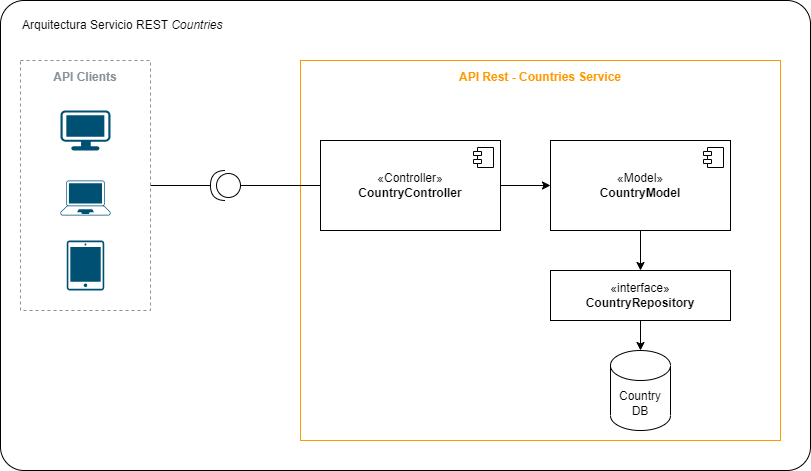

# Proyecto de Demostración Workshop Continuous Delivery 

### Descripción
Este proyecto expone una API Rest que permite consultar datos de algunos paises.
Está diseñado principalmente para la ejecución de un pipeline CI/CD en Azure DevOps. 

### Pasos del Pipeline

- Compilar aertefacto (.JAR)
- Publicar en registry
- Desplegar binario en Azure

### Tecnologias

- Springboot 2.3
- JUnit 5
- Mockito
- JaCoCo 0.8.5
- Azure VM
- Azure DevOps

### Arquitectura
El proyecteo está construido sobre una arquitectura MVC (Model-Controller)

- Controller: Responsable de recibir las peticiones a traves de API Rest y trasladarla al modelo
- Model: Contiene la definición y mapeo de entidades con el repositorio de datos
- Repository: Interface que gestiona la comunicación con la Base de datos a través del patrón DAO 

